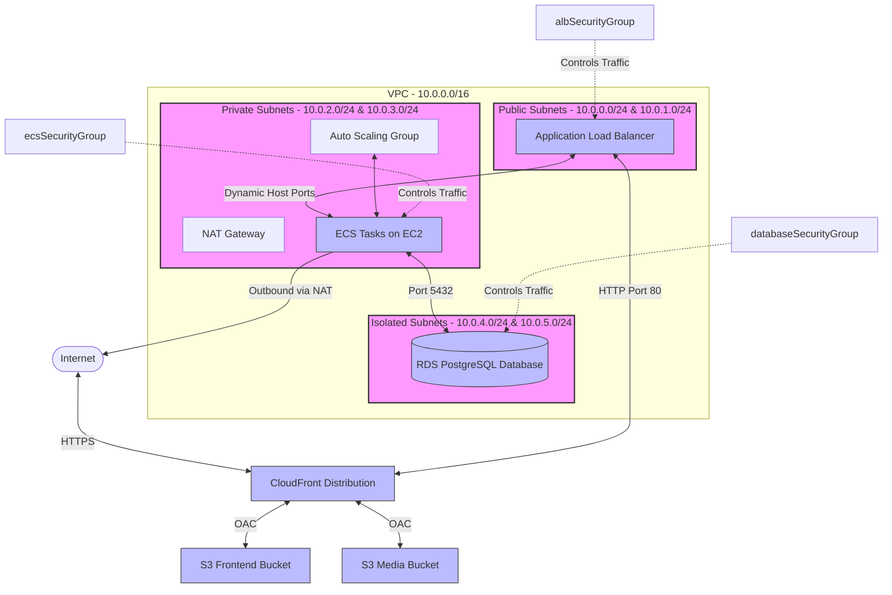

# System Architecture: Contract Checker (Django AWS Stack)

## 1. High-Level Overview

The **Contract Checker** is a containerized Django-based web application deployed on AWS. The system's infrastructure is managed via AWS CDK (TypeScript).

- **Networking**: Configured in a dedicated VPC spanning multiple availability zones with public subnets (hosting an Application Load Balancer), private subnets (hosting the container compute instances), and isolated subnets (hosting the database). High-availability NAT Gateways are used for outbound traffic.
- **Compute**: Runs containerized Django instances on Amazon Elastic Container Service (ECS) backed by an EC2 Auto Scaling Group (ASG) running ECS-optimized Linux instances.
- **Data & Storage**: Relational database storage is provided by Amazon RDS PostgreSQL (running in isolated subnets). Object storage is provided by Amazon S3, divided into a frontend host bucket and a media uploads bucket.
- **CDN**: Amazon CloudFront routes external requests, terminating SSL/TLS, caching S3 assets, and proxying API endpoints back to the Application Load Balancer.
- **Config & Secrets**: Secrets (such as database credentials) are stored and versioned in AWS Secrets Manager. Environment configuration is stored in AWS Systems Manager (SSM) Parameter Store.

---

## 2. Stack-by-Stack Breakdown

### VpcStack (`lib/vpc-stack.ts`)

- **Purpose**: Creates the base networking layer for the entire application.
- **Key Resources**:
  - `ec2.Vpc` with 3 subnet groups across 2 Availability Zones: Public (2), Private with Egress (2), and Isolated (2).
  - 1 NAT Gateway (`natGateways: 1`) and 1 Elastic IP (EIP) allocated.
- **Inputs**: `envName: string`.
- **Exports**: `vpc: ec2.Vpc`.
- **Dependencies**: None.
- **Dependents**: `SecurityGroupStack`, `RdsPostgres`, `EcsClusterStack`, `Ec2Stack`, `EcsStack`, `AlbStack`, `SsmStack`.

### SecurityGroupStack (`lib/security-group-stack.ts`)

- **Purpose**: Restricts network access between ALB, ECS task hosts, database, Lambda functions, and management hosts.
- **Key Resources**:
  - `albSecurityGroup`: Allows HTTP ingress (port 80) from `anyIpv4()`.
  - `ecsSecurityGroup`: Allows HTTP ingress (port 8000) from `albSecurityGroup` and port 8000 from `lambdaSecurityGroup`.
  - `databaseSecurityGroup`: Allows PostgreSQL ingress (port 5432) from `ecsSecurityGroup`, `lambdaSecurityGroup`, and `managementSecurityGroup`.
  - `lambdaSecurityGroup`: Allows all outbound traffic (default).
  - `managementSecurityGroup`: Used for managing other resources (e.g. database migrations).
- **Inputs**: `envName: string`, `vpc: ec2.IVpc`.
- **Exports**:
  - `albSecurityGroup: ec2.SecurityGroup`
  - `ecsSecurityGroup: ec2.SecurityGroup`
  - `databaseSecurityGroup: ec2.SecurityGroup`
  - `lambdaSecurityGroup: ec2.SecurityGroup`
  - `managementSecurityGroup: ec2.SecurityGroup`
- **Dependencies**: `VpcStack`.
- **Dependents**: `RdsPostgres`, `Ec2Stack`, `AlbStack`, `SsmStack`.

### S3Stack (`lib/s3-stack.ts`)

- **Purpose**: Provisions S3 buckets for public static hosting and application media.
- **Key Resources**:
  - `frontendBucket`: Hosts front-end assets with block public access.
  - `mediaBucket`: Hosts user uploaded assets with Cors configured.
- **Inputs**: `envName: string`.
- **Exports**: `frontendBucket: s3.Bucket`, `mediaBucket: s3.Bucket`.
- **Dependencies**: None.
- **Dependents**: `IamStack`, `CloudFrontStack`, `SsmStack`.

### EcrStack (`lib/ecr-stack.ts`)

- **Purpose**: Hosts containerized application images.
- **Key Resources**:
  - `ecr.Repository`: ECR repository configured to keep a maximum of 5 images using lifecycle rules.
- **Inputs**: `envName: string`.
- **Exports**: `repository: ecr.Repository`.
- **Dependencies**: None.
- **Dependents**: `IamStack`, `EcsStack`, `SsmStack`.

### RdsPostgres (`lib/rds-stack.ts`)

- **Purpose**: provisions a PostgreSQL relational database.
- **Key Resources**:
  - `rds.DatabaseSecret`: Secret containing database username, password, host, port, and database name.
  - `rds.DatabaseInstance`: Single-AZ PostgreSQL instance (v17) running on a `t4g.small` instance in Isolated subnets.
- **Inputs**: `envName: string`, `vpc: ec2.IVpc`, `securityGroup: ec2.ISecurityGroup`, `dbName: string`, `dbUserName: string`.
- **Exports**:
  - `database: rds.DatabaseInstance`
  - `dbSecret: secretsmanager.ISecret`
  - `host: string`
  - `port: string`
  - `dbName: string`
  - `userName: string`
- **Dependencies**: `VpcStack`, `SecurityGroupStack`.
- **Dependents**: `IamStack`, `EcsStack`, `SsmStack`.

### IamStack (`lib/iam-stack.ts`)

- **Purpose**: Declares security identities for application compute instances and task containers.
- **Key Resources**:
  - `instanceRole`: Assumed by EC2 container hosts (`ec2.amazonaws.com`).
  - `executionRole`: Assumed by ECS task manager (`ecs-tasks.amazonaws.com`) to retrieve images and secret parameters.
  - `taskRole`: Assumed by application code inside containers (`ecs-tasks.amazonaws.com`) to access media, SSM parameter store, and external APIs.
- **Inputs**: `envName: string`, `dbSecret: secretsmanager.ISecret`, `mediaBucket: s3.IBucket`, `ecrRepository: ecr.IRepository`.
- **Exports**:
  - `instanceRole: iam.Role`
  - `executionRole: iam.Role`
  - `taskRole: iam.Role`
- **Dependencies**: `RdsPostgres`, `S3Stack`, `EcrStack`.
- **Dependents**: `Ec2Stack`, `EcsStack`.

### EcsClusterStack (`lib/ecs-cluster-stack.ts`)

- **Purpose**: Provisions the base container orchestration engine (ECS cluster).
- **Key Resources**:
  - `ecs.Cluster`: Empty cluster tied to the project VPC.
- **Inputs**: `envName: string`, `vpc: ec2.IVpc`.
- **Exports**: `cluster: ecs.Cluster`.
- **Dependencies**: `VpcStack`.
- **Dependents**: `Ec2Stack`, `EcsStack`.

### Ec2Stack (`lib/ec2-stack.ts`)

- **Purpose**: Provisions backing EC2 compute nodes for the ECS Cluster.
- **Key Resources**:
  - `autoscaling.AutoScalingGroup` (ASG): Automatically scales Amazon Linux 2023 instances (`t4g.small`) in private subnets (min: 1, max: 2, desired: 1).
  - `ecs.AsgCapacityProvider`: Connects the Auto Scaling Group with ECS cluster autoscaling.
- **Inputs**: `envName: string`, `vpc: ec2.IVpc`, `ec2SecurityGroup: ec2.ISecurityGroup`, `instanceRole: iam.IRole`, `clusterName: string`.
- **Exports**: `capacityProvider: ecs.AsgCapacityProvider`.
- **Dependencies**: `VpcStack`, `SecurityGroupStack`, `IamStack`, `EcsClusterStack`.
- **Dependents**: `EcsStack`.

### EcsStack (`lib/ecs-stack.ts`)

- **Purpose**: Manages container task executions and stateful service definition.
- **Key Resources**:
  - `ecs.Ec2TaskDefinition`: Task definition in `BRIDGE` network mode with 1024 CPU and 1536 MB RAM.
  - `ecs.ContainerDefinition`: Configures Django app container port mapping (8000), AWS Logs (7-day retention), and mounts Database secrets.
  - `ecs.Ec2Service`: Service running the ECS tasks within the ECS cluster.
- **Inputs**: `envName: string`, `cluster: ecs.ICluster`, `capacityProvider: ecs.AsgCapacityProvider`, `repository: ecr.IRepository`, `executionRole: iam.IRole`, `taskRole: iam.IRole`, `containerPort: number`, `dbSecret: secretsmanager.ISecret`.
- **Exports**:
  - `service: ecs.Ec2Service`
  - `containerName: string`
- **Dependencies**: `EcsClusterStack`, `Ec2Stack`, `EcrStack`, `IamStack`, `RdsPostgres` (explicit dependency).
- **Dependents**: `AlbStack`.

### AlbStack (`lib/alb-stack.ts`)

- **Purpose**: Provides load balancing and traffic routing to the Django app.
- **Key Resources**:
  - `elbv2.ApplicationLoadBalancer`: Public load balancer inside public subnets.
  - `elbv2.ApplicationListener`: Port 80 HTTP listener.
  - `elbv2.ApplicationTargetGroup`: Targets container instances on Port 8000 with health checks pointed to `/health/`.
- **Inputs**: `envName: string`, `vpc: ec2.IVpc`, `albSecurityGroup: ec2.ISecurityGroup`, `ecsService: ecs.Ec2Service`, `containerName: string`, `containerPort: number`, `healthCheckPath: string`.
- **Exports**: `alb: elbv2.ApplicationLoadBalancer`.
- **Dependencies**: `VpcStack`, `SecurityGroupStack`, `EcsStack`.
- **Dependents**: `CloudFrontStack`.

### CloudFrontStack (`lib/cloudfront-stack.ts`)

- **Purpose**: Serves as the Entry point CDN and terminates SSL.
- **Key Resources**:
  - `cloudfront.Distribution`: Directs path `/*` to Frontend S3 bucket origin, `/media/*` to Media S3 bucket origin, and `/api/*` to ALB HTTP origin. Origin Access Control (OAC) protects S3 buckets.
- **Inputs**: `envName: string`, `frontendBucket: s3.IBucket`, `mediaBucket: s3.IBucket`, `alb: elbv2.IApplicationLoadBalancer`.
- **Exports**: `distribution: cloudfront.Distribution`.
- **Dependencies**: `S3Stack`, `AlbStack`.
- **Dependents**: `SsmStack`.

### SsmStack (`lib/ssm-stack.ts`)

- **Purpose**: Declares backend and frontend runtime parameter stores.
- **Key Resources**:
  - Multiple `ssm.StringParameter` resources written under path prefix `/${appName}/${envName}/` for backend values and `/${appName}/${envName}/fe/VITE_` for frontend values.
- **Inputs**: Full suite of resource outputs from RDS, S3, ECR, CloudFront, VPC, and Security Groups, along with environment configurations.
- **Exports**: None.
- **Dependencies**: `RdsPostgres`, `S3Stack`, `EcrStack`, `CloudFrontStack`, `VpcStack`, `SecurityGroupStack`.
- **Dependents**: None.

---

## 3. Data Flow / Request Flow

### Request Flow (External Client to RDS Database)

```
[User Browser]
      │ (HTTPS Request)
      ▼
[CloudFront Distribution (Edge)]
      │
      ├─── Path: /* ───────────► [S3 Frontend Bucket] (Via Origin Access Control)
      ├─── Path: /media/* ─────► [S3 Media Bucket] (Via Origin Access Control)
      │
      └─── Path: /api/* (Forwarded over HTTP port 80)
            │
            ▼
      [Application Load Balancer] (Public Subnet)
            │ (Dynamic Host Port Routing)
            ▼
      [ECS EC2 Container Instance] (Private Subnet)
            │ (Bridge network interface mapping)
            ▼
      [Django Docker Container]
            │ (Port 5432)
            ▼
      [RDS PostgreSQL Database] (Isolated Subnet)
```

### Secrets & Configuration Flow

1. **At Deploy Time**:
   - RDS stack provisions the PostgreSQL cluster and auto-generates credentials into a Secrets Manager `DatabaseSecret`.
   - CDK reads local environment parameters (e.g. `process.env.GEMINI_API_KEY`) and writes them, along with stack resource parameters (such as `mediaBucket.bucketName` or `cloudfront.distributionDomainName`), into SSM Parameter Store under the prefix `/${appName}/${envName}/`.
2. **At ECS Task Startup**:
   - The ECS Service requests execution of the container.
   - The ECS Agent, using the ECS **Task Execution Role**, invokes AWS Secrets Manager to resolve `DB_PASSWORD`, `DB_USERNAME`, `DB_HOST`, `DB_PORT`, and `DB_NAME` from the RDS secret. These are injected directly as environment variables into the container environment.
3. **At Runtime (Inside Container)**:
   - The Django application initializes.
   - Using the AWS SDK and assuming the ECS **Task Role**, the application performs a query to SSM Parameter Store (`ssm:GetParametersByPath` on `/${appName}/${envName}/`) to pull non-secret parameters (like `MEDIA_BUCKET`, `ALLOWED_HOSTS`, `CORS_ALLOWED_ORIGINS`) and external API credentials (like `GEMINI_API_KEY`, `JWT_SECRET`).

---

## 4. IAM Role Map

| Role Name       | Assumed By (Principal)    | Assigned Policies / Grants                                                                                                                                                                                                                                                                | Reason / Usage                                                                                                                                          |
| :-------------- | :------------------------ | :---------------------------------------------------------------------------------------------------------------------------------------------------------------------------------------------------------------------------------------------------------------------------------------- | :------------------------------------------------------------------------------------------------------------------------------------------------------ |
| `instanceRole`  | `ec2.amazonaws.com`       | `AmazonEC2ContainerServiceforEC2Role` (AWS Managed)                                                                                                                                                                                                                                       | Assigned to the Launch Template Instance Profile. Allows EC2 hosts to register with the ECS Cluster, pull metadata, and stream host logs to CloudWatch. |
| `executionRole` | `ecs-tasks.amazonaws.com` | - `AmazonECSTaskExecutionRolePolicy`<br>- Read permissions on ECR (`ecrRepository.grantPull`) <br>- Read permissions on Secrets Manager (`dbSecret.grantRead`)                                                                                                                            | Used by the ECS agent itself to pull the Django container image from ECR and fetch database secrets to inject into the container environment variables. |
| `taskRole`      | `ecs-tasks.amazonaws.com` | - Read/Write on S3 Media Bucket (`mediaBucket.grantReadWrite`) <br>- Read permissions on Secrets Manager (`dbSecret.grantRead`) <br>- `ssm:GetParameter*` on `/app-namer/${envName}/*` <br>- `lambda:InvokeFunction` on `arn:aws:lambda:${region}:${account}:function:contract-checker-*` | Used by the Django application code running inside the container to read/write uploads, fetch config parameters, and invoke the external parser Lambda. |

---

## 5. Network Diagram (Mermaid)



---

## 6. Environment & Configuration Variables

### Variables sourced from `config/env.ts`

- `envName`: Determined via CDK Context (`-c env=...`), defaults to `'dev'`. Configures environment parameters.
- `account`: Target AWS Account ID.
- `region`: Target AWS Region.
- `parentHostedZoneId` (Optional): ID of target DNS Hosted Zone.
- `domainNames` (Optional): Custom domains for SSL certificates and routing.
- `certificateArn` (Optional): Pre-created ACM certificate ARN for HTTPS.

### Variables sourced from `process.env`

- `CDK_DEV_ACCOUNT` / `CDK_DEV_REGION`: Account and Region for `dev` env.
- `CDK_STG_ACCOUNT` / `CDK_STG_REGION`: Account and Region for `stg` env.
- `CDK_PROD_ACCOUNT` / `CDK_PROD_REGION`: Account and Region for `prod` env.
- `DJANGO_SECRET_KEY`: Django cryptographic key. Defaults to empty string (`""`) if not specified.
- `GEMINI_API_KEY`: API credential for Gemini LLM.
- `JWT_SECRET`: Secret key for authentication token signing.

### SSM Parameter Store Variable Mapping

SsmStack registers the following keys under prefix paths:

| Parameter Key              | Path Prefix                      | Source Resource / Prop                  | Consumer       |
| :------------------------- | :------------------------------- | :-------------------------------------- | :------------- |
| `DB_HOST`                  | `/app-namer/${envName}/`         | `rds.host`                              | Django Backend |
| `DB_PORT`                  | `/app-namer/${envName}/`         | `rds.port`                              | Django Backend |
| `DB_NAME`                  | `/app-namer/${envName}/`         | `rds.dbName`                            | Django Backend |
| `DB_USERNAME`              | `/app-namer/${envName}/`         | `rds.userName`                          | Django Backend |
| `DB_SECRET_NAME`           | `/app-namer/${envName}/`         | `rds.dbSecret.secretName`               | Django Backend |
| `AWS_REGION`               | `/app-namer/${envName}/`         | `Stack.region`                          | Django Backend |
| `ENVIRONMENT`              | `/app-namer/${envName}/`         | `props.envName`                         | Django Backend |
| `LOG_LEVEL`                | `/app-namer/${envName}/`         | `'INFO'` (Default)                      | Django Backend |
| `DJANGO_SECRET_KEY`        | `/app-namer/${envName}/`         | `process.env.DJANGO_SECRET_KEY`         | Django Backend |
| `ALLOWED_HOSTS`            | `/app-namer/${envName}/`         | `cloudfront.distributionDomainName`     | Django Backend |
| `CORS_ALLOWED_ORIGINS`     | `/app-namer/${envName}/`         | `cloudfront.distributionDomainName`     | Django Backend |
| `MEDIA_BUCKET`             | `/app-namer/${envName}/`         | `s3.mediaBucket.bucketName`             | Django Backend |
| `FRONTEND_BUCKET`          | `/app-namer/${envName}/`         | `s3.frontendBucket.bucketName`          | Django Backend |
| `CLOUDFRONT_URL`           | `/app-namer/${envName}/`         | `cloudfront.distributionDomainName`     | Django Backend |
| `ECR_REPOSITORY_URI`       | `/app-namer/${envName}/`         | `ecrRepository.repositoryUri`           | Django Backend |
| `GEMINI_API_KEY`           | `/app-namer/${envName}/`         | `process.env.GEMINI_API_KEY`            | Django Backend |
| `JWT_SECRET`               | `/app-namer/${envName}/`         | `process.env.JWT_SECRET`                | Django Backend |
| `VPC_ID`                   | `/app-namer/${envName}/`         | `vpc.vpcId`                             | Django Backend |
| `PRIVATE_SUBNET_ID`        | `/app-namer/${envName}/`         | `vpc.privateSubnets[0].subnetId`        | Django Backend |
| `LAMBDA_SECURITY_GROUP_ID` | `/app-namer/${envName}/`         | `sg.lambdaSecurityGroup`                | Django Backend |
| `API_URL`                  | `/app-namer/${envName}/fe/VITE_` | `cloudfront.distributionDomainName/api` | Frontend SPA   |

---

## 7. Known Assumptions & Gaps

This infrastructure depends on several pre-existing assets and manual tasks not resolved or provisioned by this CDK codebase:

1. **Secrets & External Credentials**:
   - `DJANGO_SECRET_KEY`, `GEMINI_API_KEY`, and `JWT_SECRET` are not generated by the stack and must be populated in the environment before deploying, otherwise they default to blank values.
2. **DNS & ACM Certs (Custom Domain configuration)**:
   - There is no Hosted Zone or SSL Certificate lookup configured. CloudFront runs using the default `*.cloudfront.net` hostname and self-signed certificate, requiring manual configurations if a vanity domain name is desired.
3. **Pre-existing Lambda Function**:
   - The IAM role map assumes a Lambda function matching the pattern `contract-checker-*` is already deployed, as the task role requires it to make invocation calls, but no Lambda function is declared in this CDK project.
4. **ECR Image Pull / Push**:
   - The ECS container definition relies on a pre-existing image in the ECR repository. If no image exists, the ECS service deployment will hang indefinitely.
5. **unused Helper Code**:
   - `helpers/user-data.ts` contains helper logic (`createEc2UserData`) to run raw docker containers on EC2. This logic is imported nowhere and appears to be a redundant artifact, as task orchestration is instead managed via ECS container definitions.
